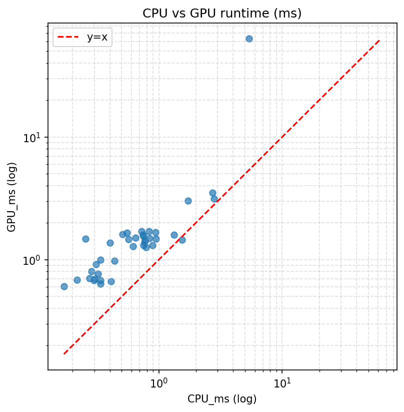
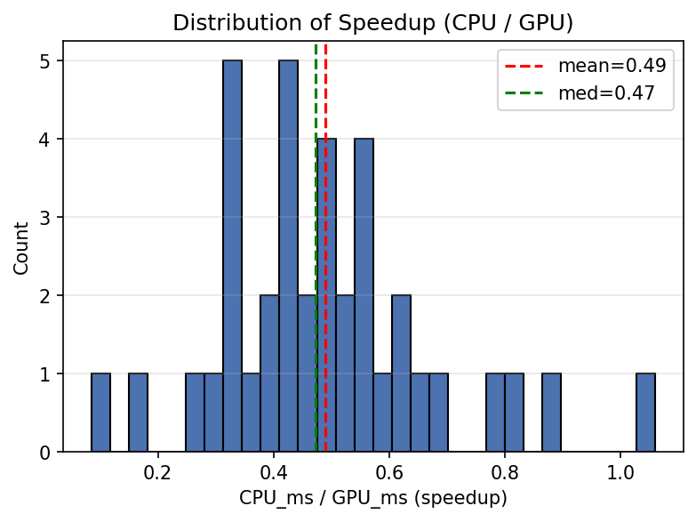
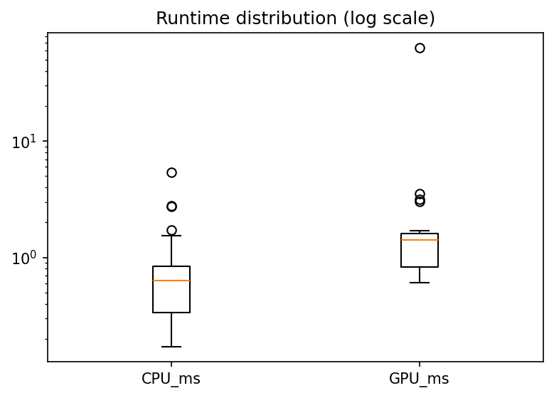
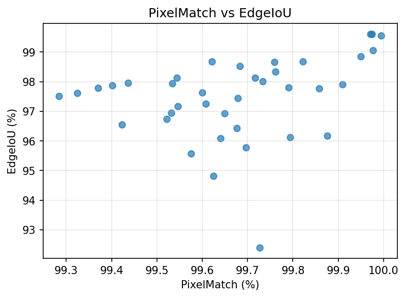

# Benchmark Analysis

This report summarizes the benchmark results comparing CPU vs GPU Canny edge detection.

## Summary statistics

See `analysis_stats.txt` for numeric summary. Key observations below.

- Mean CPU runtime: 0.864 ms
- Mean GPU runtime: 3.000 ms
- Mean speedup (CPU/GPU): 0.489
- Median speedup (CPU/GPU): 0.472

## Plots

### CPU vs GPU runtime (log-log scatter)

### Speedup distribution (CPU_ms / GPU_ms)

### Runtime distributions (boxplot, log scale)

### PixelMatch vs EdgeIoU

## Short analysis / observations
- Many entries show `ComputedSpeedup < 1.0`, indicating the GPU path was slower in those cases, likely due to short runtimes where CPU is already fast or due to upload/download overhead.
- The scatter plot (log-log) shows how runtimes compare across orders of magnitude; ideally points below the y=x line indicate faster GPU.
- The speedup histogram and summary stats give the central tendency (mean/median).
- PixelMatch and EdgeIoU are generally high (close agreement) according to the data; see the `pixelmatch_vs_iou` plot.
